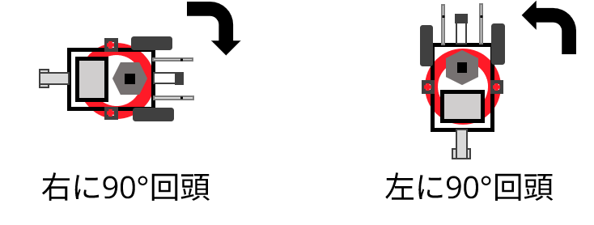
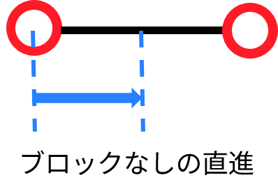
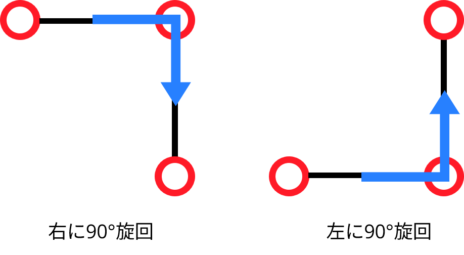
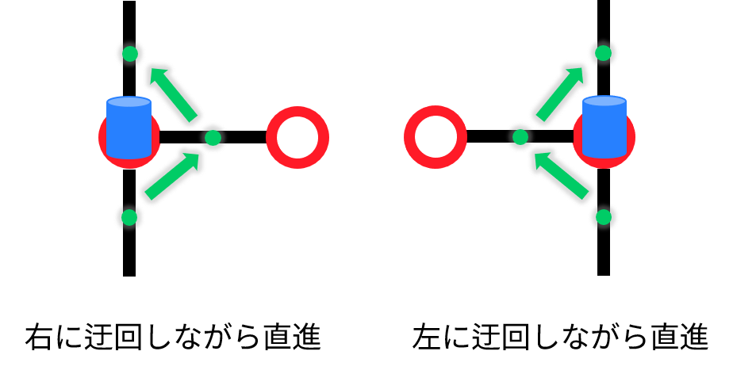
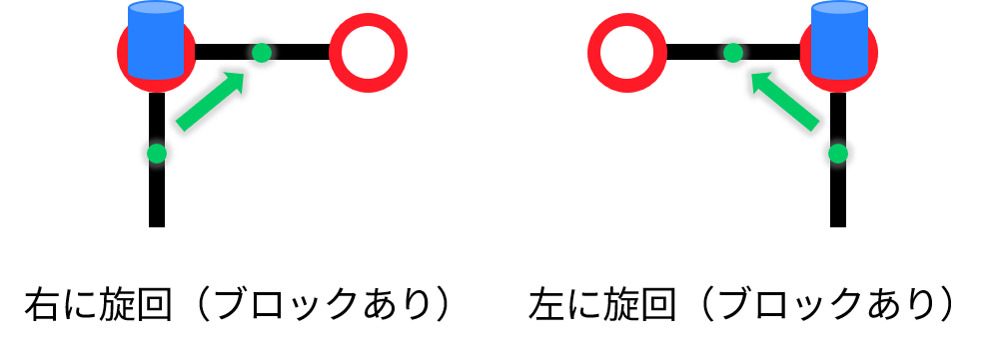
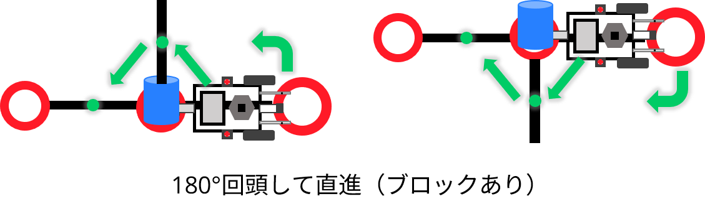
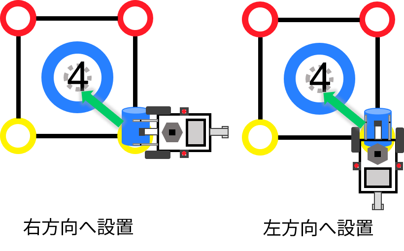

# ブロックビンゴ攻略に用いる各クラスの説明
我々K-Labは、ブロックビンゴで達成する目標として
 * ボーナスサークル2個設置
 * ダブルビンゴ成立
を掲げた。 

このディレクトリは、上記の目標を達成するための運搬経路を計算するクラスがまとめられている。以下では、各ファイルに記述しているクラスの説明と運搬経路を走行体にBluetooth通信で送信するためのコマンド変換手順について述べる。

## `block_bingo_coordinate.py`
 ブロックビンゴにおけるサークルは、ブロックサークルと交点サークルに分けることができる。これらの座標はそれぞれ、`BlockCirclesCoordinate`と `CrossCirclesCoordinate`としてクラスで管理している。

## `block_circles_path.py`
K-Labの目標の1つであるボーナスサークル設置2個のうち、1つの黒ブロックはブロックサークル内に配置されている。そこで、我々はまずブロックサークル内に配置されている黒ブロックをボーナスサークルまで設置する戦略を採った。

この`block_circles_path.py`は、ブロックサークル内に配置された黒ブロックの運搬経路を求めるクラス`BlockCirclesSolver`を記述している。

## `black_block_commands.py`
`block_circles_path.py`で計算したブロックサークル間の運搬経路を走行体へBluetooth通信で送信するためのコマンド変換をまとめている。

## `block_bingo_solver.py`
ダブルビンゴ成立のためのブロック（カラーブロック + 交点サークルに配置された黒ブロック）をブロックサークルへ運搬する経路を計算するクラス`BlockBingoSolver`を記述している。

ビンゴ成立のための運搬経路は、`block_circles_path`によってブロックサークル間の運搬経路を計算したあとで呼び出す必要がある。

`BlockBingoSolver`の運搬経路は、[A\*アルゴリズム](https://ja.wikipedia.org/wiki/A*)を用いて探索する。
A\*アルゴリズムで使用するコストは、候補となる運搬経路それぞれに関する移動コストと予測コストの総和である。
移動コストとは、走行体の動作手順をもとに導いたコストである。移動コストの一覧を下記表に示す。

|動作|ブロックなし|ブロックあり|
|---|---|---|
|回頭|1|-|
|直進|1|5|
|旋回(90°)|3|3|
|旋回(180°)|2|6|

また、予測コストは対象ノードから終点までの[マンハッタン距離](https://ja.wikipedia.org/wiki/%E3%83%9E%E3%83%B3%E3%83%8F%E3%83%83%E3%82%BF%E3%83%B3%E8%B7%9D%E9%9B%A2)である。

## `rule_book.py`
ゲームの終了判定をするための`RuleBook`クラスを記述している。この`RuleBook`でゲームの終了判定をすることで`block_bingo_solver.py`の`BlockBingoSolver`が運搬経路の計算を終了できる。
また当ファイルには、ビンゴ状態を表す`Bingo`列挙体も記述している。`BlockBingoSolver`が運搬経路を計算する際にビンゴ状態を引数として渡すことで、ゲームの終了判定を変更できる。（デフォルトでは、上記目標にある通り、ダブルビンゴである）

## `commands.py`
`block_bingo_solver.py`の`BlockBingoSolver`によって計算した運搬経路をコマンドに変換するクラス`Command`を記述している。
コマンドの変換手順は、以下の[コマンド変換](#コマンド変換)で示す。
# コマンド変換

ゲーム攻略のための運搬経路を各種コマンドへ変換するために必要な引数は、以下の4つである。また、これらに加えて走行体の状態を知るために運搬経路もすべての変換に関して用いる。

コマンドに変換した結果は、随時「コマンドリスト」に記録していく。コマンドリストは、LIFO方式のデータ構造である（例えば、スタック）。

`src, dst, direction, has_block`

`src`:	始点の座標（例 (1,1) など）

`dst`:	終点の座標（例 (1,2) など）

`has_block`: 始点にブロックが存在しているか？

## 回頭

回頭には、右に90°回頭（コマンドは`d`）と左に90°回頭（コマンドは`e`）の2種類がある。なお、運搬中の回頭はすべて「旋回」または「180°回頭して直進」に変換するため、「回頭」コマンドへ変換するのは運搬開始時のみである。



### コマンド変換例

```python
(1,1), (1,1.5), 0, False	=>	d
(1,1), (1,1.5), 4, False	=>	e
(1,1), (1,0.5), 0, False	=>	e
(1,1), (1,0.5), 4, False	=>	d
```

### コマンド変換手順

1. `src` の前に運搬経路が存在しないことを確認する。（存在していれば、回頭コマンドには変換しない）
2. `direction` が次に走行体が向く方向になるまでコマンド変換する。
3. 走行体が次に向く方向を、現在の走行体の向きとして記録する。


## 直進（ブロックなし）

ブロックなしの直進とは、走行体が向きを変えずに黒線の中点の長さだけ移動することである。ブロックなしの直進は、コマンド`u`に対応する。



### コマンド変換例

```python
(1,1), (0.5,1), 0, False	=>	u
(1,1), (1,1.5), 2, False	=>	u
(1,1), (1.5,1), 4, False	=>	u
(1,1), (1,0.5), 6, False	=>	u
```

### コマンド変換手順

1. `src` から`dst` の向きと`direction` が等しいことを確認する。（等しくなければ、旋回に変換する）
2. `has_block` が`False` であることを確認する。（`True` であれば、[ブロックありの直進](#直進（ブロックあり）)に変換する）
3. `u` にコマンド変換する。

## 旋回（ブロックなし）

ブロックなしの旋回とは、黒線の中点から交点サークルへ移動したのち、回頭し、次の黒線の中点まで移動することである。ブロックなしの旋回には、右に90°旋回（コマンド`k`）と左に90°旋回（コマンド`m`）の2種類がある。



### コマンド変換例

```python
(1,1), (1.5,1), 0, False	=>	k
(1,1), (1,0.5), 0, False	=>	m
```

### コマンド変換手順

ブロックなしの旋回は、黒線の中点から中点までの移動である。これを、黒線の中点から交点サークルまでの移動と交点サークルから黒線の中点までの移動の2つに分けて考える。

1つ目の黒線の中点から交点サークルまでの移動（すなわちブロックなしの直進）に関しては旋回のコマンド変換を実行する1つ前に変換済みだから、その直進コマンドを走行体の向きを考慮しつつ旋回コマンドへ書き換えてあげればよい。

1. `has_block` が`False` であることを確認する。（`True` であれば、[ブロックありの旋回](#6. 旋回（ブロックあり）)に変換する）
2. `src` と`dst` から走行体が次に向く方向を求める。
3. コマンドリストのトップを2.で求めた向きの旋回コマンドへ書き換える。

## 180°回頭して直進（ブロックなし）

180°回頭して直進とは、走行体が180°回頭したのち、黒線の中点の長さだけ移動することである。ブロックなしの180°回頭して直進は、コマンド `n` に対応する。


### コマンド変換例

```python
(1,1), (1.5,1), 0, False	=>	n
(1,1), (1,0.5), 2, False	=>	n
(1,1), (0.5,1), 4, False	=>	n
(1,1), (1,1.5), 6, False	=>	n
```

### コマンド変換手順

1. `has_block` が`False` であることを確認する。（`True` であれば、[ブロックありの180°回頭して直進](#180°回頭して直進（ブロックあり）)に変換する）
2. `n` にコマンド変換する。

## 直進（ブロックあり）

ブロックありの直進とは、黒線の中点から中点までブロックを避けながら移動することである。ブロックの迂回は、右方向（コマンド`h`）と左方向（コマンド`i`）がある。これは、迂回先に必ず黒線があるようにするためである。



### コマンド変換例

```python
(1,0), (0.5,0), 0, True	=>	h
(3,1), (3,0.5), 6, True	=>	h
(2,3), (2.5,3), 0, True	=>	i
(3,2), (3,2.5), 4, True	=>	i
```

### コマンド変換手順

ブロックありの直進は、中点から中点までの移動である。

ブロックありの直進へコマンド変換する際に、走行体はすでに始点となる黒線の中点から交点サークルまで移動（すなわちブロックなしの直進）したことになっている。したがってブロックありの直進に変換するためには、ブロックなしの直進をブロックありの直進に書き換えてあげればよい。

また、ブロックありの直進は上述した通り、右方向の迂回と左方向の迂回がある。そこで、格子状エリアの右側と下側の端のみ変換処理を変える。

1. `src` の行番号が3または`src` の列番号が3のとき、3.を処理する。
2. （`dst` の行番号 < `src` の行番号）または（`src` の列番号 < `dst` の列番号）のとき、コマンドリストのトップを `h` に書き換える。そうでなければ、コマンドのトップを`i` に書き換える。
3. （`src` の行番号 < `dst` の行番号）または（`dst` の列番号 < `src` の列番号）のとき、コマンドリストのトップを `i` に書き換える。そうでなければ、コマンドのトップを`h` に書き換える。

## 旋回（ブロックあり）

ブロックありの旋回とは、黒線の中点から中点まで移動である。ただし、[ブロックなしの旋回](#旋回（ブロックなし）)と異なる点は、交点サークルを走行体が通らない部分である。また、ブロックありの旋回には右方向の旋回（コマンド `j`）と左方向の旋回（コマンド `l`）の2種類がある。



### コマンド変換例

```python
(1,1), (1,1.5), 0, True	=>	j
(1,1), (1,0.5), 0, True	=>	l
```

### コマンド変換手順

コマンドの変換手順は、概ね[ブロックなしの旋回](#3. 旋回（ブロックなし）)と同じである。

1. `src` と`dst` から走行体が次に向く方向を求める。
2. コマンドリストのトップを2.で求めた向きの旋回コマンドへ書き換える。

## 180°回頭して直進（ブロックあり）

ブロックありの180°回頭して直進とは、走行体が180°回頭したのち、黒線の中点から中点に向かってブロックを迂回しながら移動することである。この動作は、走行体が180°回頭したのち、[ブロックありの直進](#直進（ブロックあり）)をすることと等価である。したがって、ブロックありの180°回頭して直進の変換に必要なコマンドは、180°回頭の`f` だけである。



### コマンド変換例

```python
(1,1), (1,1.5), 6, True	=>	f, h
(0,2), (0,1.5), 2, True	=>	f, i
```

### コマンド変換手順

ブロックを迂回する方向の決定は、[ブロックありの直進](#直進（ブロックあり）)に従う。まず1つ目に180°回頭の変換をし、2つ目にブロックありの直進の変換をする。しかしながら、ブロックありの直進は、前回のコマンド（コマンドリストの先頭）を書き換えてしまうため、一度取り出す必要がある。

1. コマンドリストの先頭を取り出す。
2. 180°回頭を表すコマンド`f`をコマンドリストへ追加し、`direction` を更新する。
3. 1.で取り出したコマンドをコマンドリストへ追加する。
4. 引数 `src, dst, direction, True`でブロックありの直進に変換する。


### コマンド変換手順

1. `src` が黒線の中点を示していることを確認する。（もし異なれば、[交点サークルからブロック設置](#交点サークルからブロック設置)へ変換する）
2. `dst` をもとに走行体がブロックサークルに向くために必要な回頭のコマンドへ変換する。
3. `g` にコマンド変換する。

## 交点サークルからブロック設置

交点サークルからブロック設置とは、交点サークルを始点としてブロックサークルへブロックを設置することである。

1つの交点サークルに関して、1つのブロックサークルの周囲に伸びる黒線は2つあるから、交点サークルからブロック設置のコマンドも2種類に分かれる。2種類のコマンドは、交点サークルからブロックサークルに向けて右方向に旋回しながら設置する動作（コマンド `y`）と左方向に旋回しながら設置する動作（コマンド `z`）の違いがある。



### コマンド変換例

`src` は走行体の現在地を表し、`dst` はブロックサークルの座標を表している。

```Python
(2,1), (1,0), 0, False	=>	z
(2,1), (1,0), 2, False	=>	e, z
(2,1), (1,0), 4, False	=>	d, y
(2,1), (1,0), 6, False	=>	y
```

### コマンド変換手順

1. `dst` をもとに走行体がブロックサークルに向くために必要な回頭のコマンドへ変換する。必要なければ、コマンド変換しない。
2. 回頭した`direction` と `dst` をもとにして、コマンド変換する。
